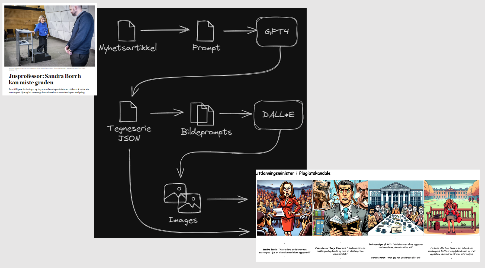

# news2toon

Script for å generere tegneseriestriper basert på nyhetsartikler. For å få til dette brukes en kombinasjon av ChatGPT og Dall-E.

ChatGPT brukes for å generere én JSON med innholdet til tegneseriestripen - fire celler, hvor hver celle har en bildebeskrivelse, med tilhørende tekster for personene som opptrer i denne cellen. Hver bildebeskrivelse sendes så til Dall-E for å få generert opp bilder. Vi syr så sammen bildene og tekstene til én tegneseriestripe lokalt.





## Eksempel

Nyhetsartikkel:

https://www.nrk.no/nordland/kvinne-fodte-pa-badegulvet-mens-samboeren-sov-1.16720938

Output:


## Oppsett

Om du ikke allerde har python installert, vil jeg anbefale å gjøre dette med [pyenv](https://github.com/pyenv/pyenv). Dette prosjektet krever python 3.11 eller høyere.

Prosjektet bruker poetry for å håndtere python-miljøet. Installasjonsinstruksjoner kan du finne [her](https://python-poetry.org/docs/#installation).

Når poetry er installert kan du installere python-avhengighetene ved å kjøre `poetry install`.

Du må se sette opp to modeller i Azure - én for ChatGPT og én for Dall-E. Lag så en kopi av `.env.dist` som du kaller `.env` og fyll inn nødvendige miljøvariabler der. Hvordan du setter opp en modell i Azure er beskrevet [her](https://learn.microsoft.com/en-us/azure/ai-services/openai/how-to/working-with-models?tabs=powershell). Vi brukte `gpt-4` og `dall-e-3`, men andre versjoner av disse modellene kan muligens også funke.

Du kan så kjøre koden ved å kjøre `__main__.py` i IDEen din, eller du kan kjøre følgende fra kommandolinja:

```
poetry run python news2toon/
```